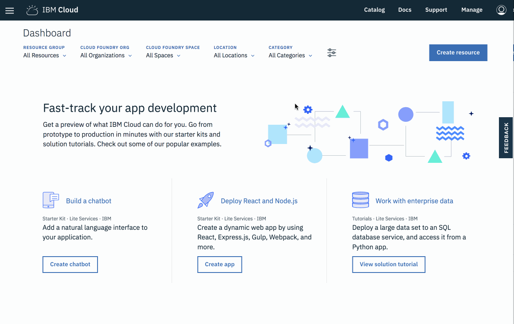

# Setting Up the CLI

## Install IBM Cloud CLI

1. Open the [IBM Cloud Docs](https://console.bluemix.net/docs/) page.
2. Open the _"_[_IBM Cloud Developer Tools \(CLI\)_](https://console.bluemix.net/docs/cli/index.html#overview)_"_ link from the _"IBM Cloud"_ section.
3. Click on the _"_[_Download and install IBM Cloud CLI_](https://console.bluemix.net/docs/cli/reference/bluemix_cli/download_cli.html#download_install)_"_ link under _"HOW TO"_ section in the left-hand menu.
4. Follow the steps listed under the [_"Install from shell"_](https://console.bluemix.net/docs/cli/reference/bluemix_cli/download_cli.html#shell_install) section to download and install the IBM Cloud CLI.
5. MacOS: `curl -fsSL https://clis.ng.bluemix.net/install/osx | sh`
6. Linux: `curl -fsSL https://clis.ng.bluemix.net/install/linux | sh`
7. Windows \(Powershell\): `iex(New-Object Net.WebClient).DownloadString('https://clis.ng.bluemix.net/install/powershell')`



## Log Into IBM Cloud CLI

1. Use this command to authenticate the IBM Cloud CLI with your account credentials.

   ```text
   $ ibmcloud login
   ```

2. Choose an API endpoint from the list. _**IBM Cloud Functions is available in the following regions:**_ `eu-de`_**,**_ `eu-gb` _**and**_ `us-south`_**. Choose the default account region from the previous section.**_

   ```text
   Select an API endpoint:
   1. eu-de - https://api.eu-de.bluemix.net
   2. au-syd - https://api.au-syd.bluemix.net
   3. us-east - https://api.us-east.bluemix.net
   4. us-south - https://api.ng.bluemix.net
   5. eu-gb - https://api.eu-gb.bluemix.net
   6. Enter a different API endpoint
   Enter a number>
   ```

3. Enter account credentials for your IBM Cloud account.

   ```text
   Email> user@email.com

   Password>
   Authenticating...
   OK

   Select an account (or press enter to skip):
   1. John Smith's Account (xxx)
   Enter a number>

   API endpoint:     https://api.eu-gb.bluemix.net (API version: 2.92.0)
   Region:           eu-gb
   User:             user@email.com
   Account:          No account targeted, use 'bx target -c ACCOUNT_ID'
   Resource group:   No resource group targeted, use 'bx target -g RESOURCE_GROUP'
   Org:
   Space:
   ```

4. Run the following command to configure the organisation and space the CLI is targeting.

   ```text
   $ ibmcloud target --cf
   Targeted org user@email.com
   Targeted space dev

   API endpoint:     https://api.eu-gb.bluemix.net (API version: 2.92.0)
   Region:           eu-gb
   User:             user@email.com
   Account:          No account targeted, use 'bx target -c ACCOUNT_ID'
   Resource group:   No resource group targeted, use 'bx target -g RESOURCE_GROUP'
   Org:              user@email.com
   Space:            dev
   ```

🎉🎉🎉 **Congratulations, you've successfully registered an IBM Cloud account and logged into the IBM Cloud CLI.** 🎉🎉🎉

