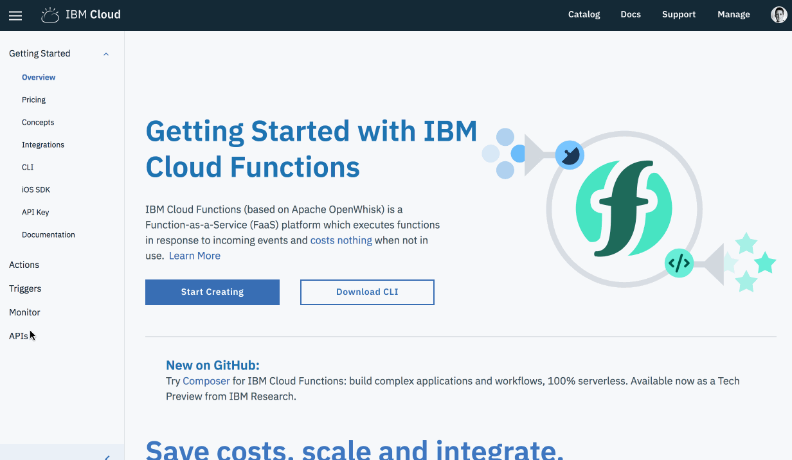
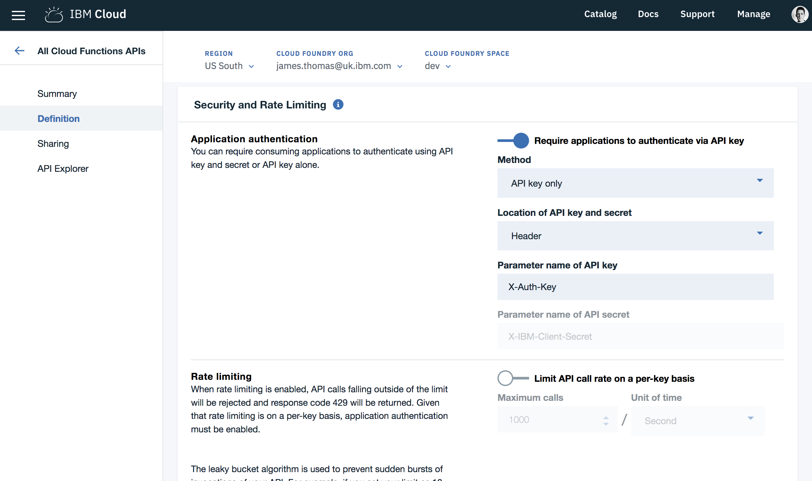
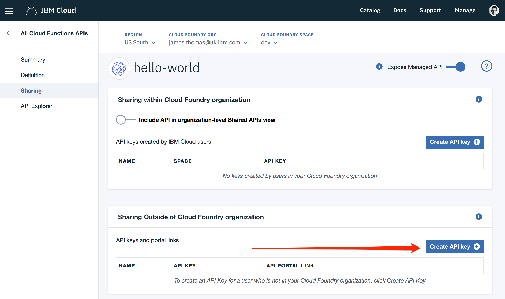
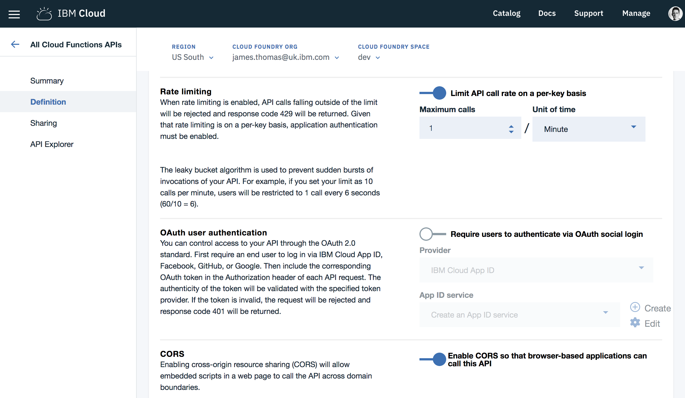

# API Gateway

## API Gateway

OpenWhisk web actions can benefit from being exposed using the API gateway.

The API Gateway acts as a proxy to [Web Actions](https://github.com/apache/incubator-openwhisk/blob/master/docs/webactions.md) and provides them with additional features including HTTP method routing , client id/secrets, rate limiting and CORS. For more information on API Gateway feature you can read the [api management documentation](https://github.com/apache/incubator-openwhisk-apigateway/blob/master/doc/v2/management_interface_v2.md)

### Example

Let's look a short example of using the API Gateway service…

1. Ensure the `hello` action is enabled as a web action.

```text
$ ibmcloud wsk action update hello --web true
ok: updated action hello
```

1. Create a new API Gateway endpoint for the web action.

```text
$ ibmcloud wsk api create /api/hello get hello --response-type json --apiname "hello-world"
ok: created API /api/hello GET for action /_/hello
https://service.us.apiconnect.ibmcloud.com/gws/apigateway/api/<UUID>/api/hello
```

1. Check HTTP API returns JSON response.

```text
$ curl "https://service.us.apiconnect.ibmcloud.com/gws/apigateway/api/<UUID>/api/hello?name=Bernie"
{
  "payload": "Hello, Bernie from Vermont"
}
```

1. Check other HTTP methods are not supported.

```text
$ curl -XPOST "https://service.us.apiconnect.ibmcloud.com/gws/apigateway/api/<UUID>/api/hello?name=Bernie"
{"status":404,"message":"Error: Whoops. Verb not supported."}
```

1. Enable other endpoints and verbs.

```text
$ ibmcloud wsk api create /api/hello/world get hello --response-type json --apiname "hello-world"
ok: created API /api/hello/world GET for action /_/hello
https://service.us.apiconnect.ibmcloud.com/gws/apigateway/api/<UUID>/api/hello/world
$ curl "https://service.us.apiconnect.ibmcloud.com/gws/apigateway/api/<UUID>/api/hello/world?name=Bernie"
{
  "payload": "Hello, Bernie from Vermont"
}
```

```text
$ ibmcloud wsk api create /api/hello post hello --response-type json --apiname "hello-world"
ok: created API /api/hello POST for action /_/hello
https://service.us.apiconnect.ibmcloud.com/gws/apigateway/api/<UUID>/api/hello
$ curl -XPOST "https://service.us.apiconnect.ibmcloud.com/gws/apigateway/api/<UUID>/api/hello?name=Bernie"
{
  "payload": "Hello, Bernie from Vermont"
}
```

### Saving & Restoring

1. List all the exposed API endpoints.

```text
$ ibmcloud wsk api list
```

1. Export the API definitions to a Swagger file.

```text
$ ibmcloud wsk api get / > swagger.json
```

1. Delete all the API definitions.

```text
$ ibmcloud wsk api delete /
ok: deleted API /
```

1. Check there are no more APIs defined.

```text
$ ibmcloud wsk api list
ok: APIs
Action                            Verb             API Name  URL
```

1. Restore from Swagger file.

```text
$ ibmcloud wsk api create --config-file swagger.json
```

1. Confirm the APIs have been re-created.

```text
$ ibmcloud wsk api list
```

## API Management Features

IBM Cloud Functions supports using the IBM API Management service to support more advanced features including authentication, rate limiting, CORS and more. These features are available when using the IBM Cloud Functions Web UI to create and modify the API endpoints.

Let's look at setting up some of these features for the API endpoints we have already defined…

1. Open the [IBM Cloud Functions](https://console.bluemix.net/openwhisk/) homepage.
2. Navigate to the [APIs](https://console.bluemix.net/openwhisk/apimanagement) page.
3. Click the "hello world" API in the table.
4. Select the "Definition" link from the API details menu.



### Authentication

Let's turn on custom authentication for our APIs to ensure only authorised users use them.

1. Under the "_Security and Rate Limiting_" section, toggle the switch to enable authentication.
2. Check "_Method_" is "_API key only_" and "_Location_" is "_Header_".
3. Set the "_Parameter name of API key_" to "_X-Auth-Key_"
4. Click the "_Save_" button to update the API definition.



Once we have enabled API authentication, we need to create the API keys on the "_Sharing_" panel.

1. Under the "_Sharing Outside of Cloud Foundry organization_" section, select "_Create API key_"



1. Set the key name as "_sample-key_" and make a note of the API key value.
2. Click the "_Create_" button.

If the key has been created correctly the table should now display the newly enabled key.

Let's try out calling one of our API endpoints without an API key.

```text
$ ibmcloud wsk api list
ok: APIs
Action                                Verb     API Name  URL
/user@host.com_dev/hello     get  hello-world  https://service.us.apiconnect.ibmcloud.com/gws/apigateway/api/<UUID>/api/hello
/user@host.com_dev/hello    post  hello-world  https://service.us.apiconnect.ibmcloud.com/gws/apigateway/api/<UUID>/api/hello
/user@host.com_dev/hello     get  hello-world  https://service.us.apiconnect.ibmcloud.com/gws/apigateway/api/<UUID>/api/hello/world
$ curl https://service.us.apiconnect.ibmcloud.com/gws/apigateway/api/<UUID>/api/hello
{"status":401,"message":"Error: Unauthorized"}
```

If we now call the same API endpoint with the authentication header, it should succeed.

```text
$ curl -H X-Auth-Key:<INSERT_YOUR_KEY> "https://service.us.apiconnect.ibmcloud.com/gws/apigateway/api/<UUID>/api/hello?name=Bernie"
{
  "payload": "Hello, Bernie from Vermont"
}
```

_Hurrah it works!_

IBM API Management also provides authentication support including keys with secrets and OAuth integration.

### Rate Limiting

Let's enable rate limiting on our APIs to ensure we don't have to pay too much! Rate limiting is only supported when authentication is enabled. Limits are on a per-key basis.

1. Under the "_Security and Rate Limiting_" section, toggle the "_Rate Limiting_" switch to on.
2. Set "_Maximum Calls_" to 1 and "_Unit of time_" to "_Minutes_"
3. Click the "_Save_" button to update the API definition.



Let's check rate limiting is working.

1. Call the authenticated endpoint twice in succession.

```text
$ curl -H X-Auth-Key:<INSERT_YOUR_KEY> "https://service.us.apiconnect.ibmcloud.com/gws/apigateway/api/<UUID>/api/hello?name=Bernie"
{
  "payload": "Hello, Bernie from Vermont"
}
$ curl -H X-Auth-Key:<INSERT_YOUR_KEY> "https://service.us.apiconnect.ibmcloud.com/gws/apigateway/api/<UUID>/api/hello?name=Bernie"
{
  "status":429,
  "message":"Error: Rate limit exceeded"
}
```

On the first call, the response is returned as normal. On the second call, the rate limiting error should be returned. If you wait sixty seconds and try again, the request will be processed as normal.

🎉🎉🎉 **The API Gateway service add services like request routing, based on method and paths, rate limiting and pluggable authentication. It is perfect for high-traffic public APIs.** 🎉🎉🎉

