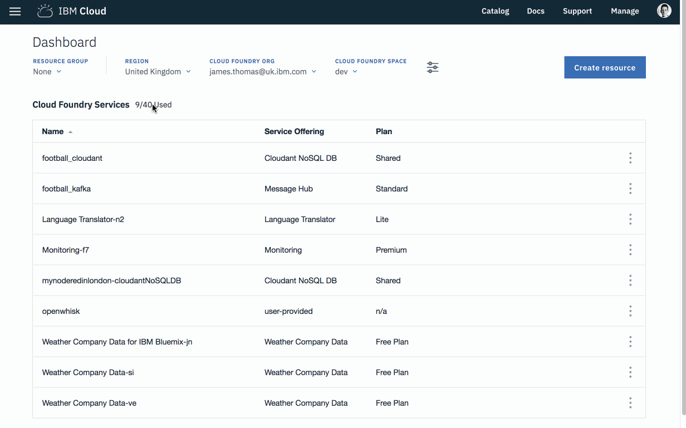

# IBM Cloud Functions Web UI

This exercise will introduce the [IBM Cloud Functions Web UI](https://console.bluemix.net/openwhisk/). This application helps to manage your IBM Cloud Functions applications from a web browser, rather than using the command-line.

_Once you have completed this exercise, you will have…_

* **Understood how to find and use the IBM Cloud Functions Web UI.**

Once this exercise is finished, you will be able to use the web ui to build and manage serverless applications on IBM Cloud!

## Table Of Contents

* [Background](./#background)
* [Navigating To The IBM Cloud Functions Homepage](./#navigating-to-the-ibm-cloud-functions-homepage)
* [Actions](actions.md#actions)
  * [Details Overview](actions.md#details-overview)
  * [Invoking Actions](actions.md#invoking-actions)
  * [Creating Actions](actions.md#creating-actions)
* [Triggers](triggers.md#triggers)
  * [Details Overview](triggers.md#details-overview)
  * [Creating Triggers](triggers.md#creating-triggers)
* [Monitoring](monitoring_and_apis.md#monitoring)
* [APIs](monitoring_and_apis.md#apis)
  * [Details Overview](monitoring_and_apis.md#details-overview)
  * [Creating APIs](monitoring_and_apis.md#creating-apis)

### Background

IBM Cloud Functions comes with a Web UI to help developers manage their serverless applications. Common development tasks such as creating actions, monitoring invocations, setting up triggers and more can all be achieved using this web application. The web application is custom to IBM Cloud and not part of the open-source Apache OpenWhisk project.

It can often be quicker to use the Web UI for certain development tasks, rather than typing repetitive CLI commands. The web UI integrates with the IBM Cloud interface, making it easy to provision and connect new cloud services to your applications.

In this exercise, we'll show you the different features of the IBM Cloud Web UI….

### Navigating To The IBM Cloud Functions Homepage

1. Open the [IBM Cloud homepage](https://console.bluemix.net).
2. Click to show the menu on the left-hand side.
3. Click "Functions" in the list to open the [IBM Cloud Functions homepage](https://console.bluemix.net/openwhisk/).

   

