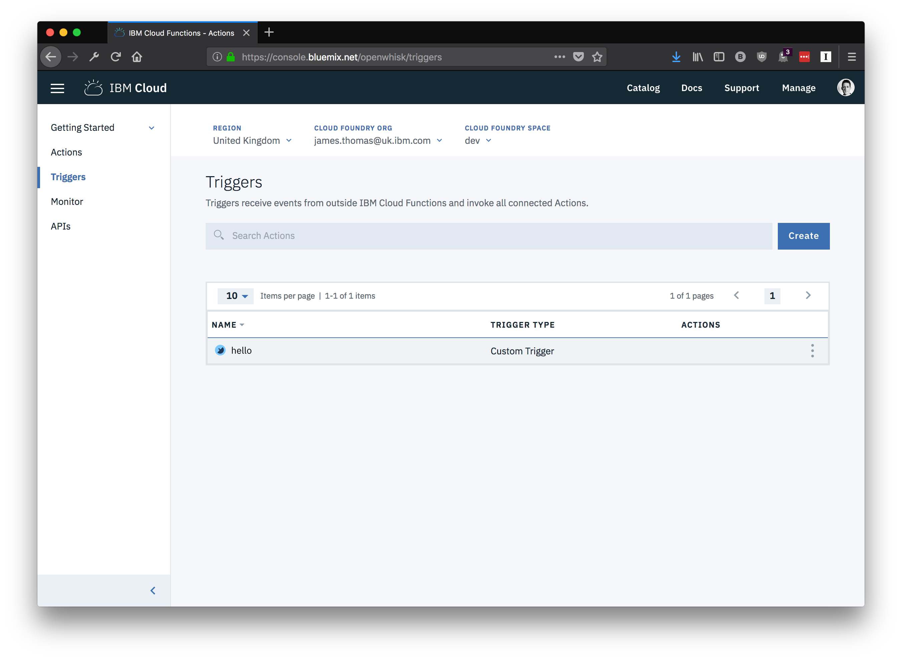
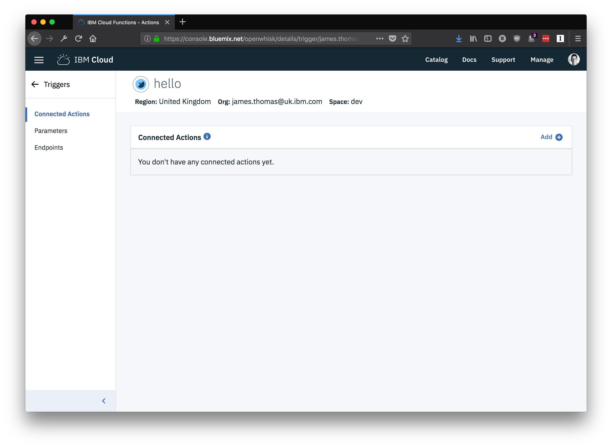
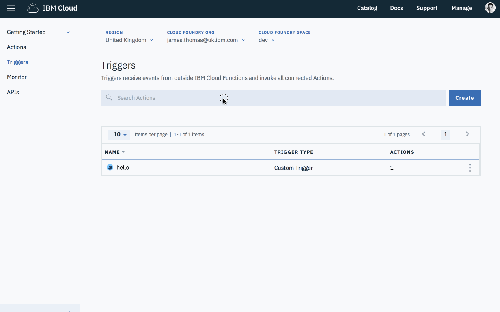

# Triggers

1. Select "Triggers" from the left-hand menu panel on the homepage.

[This page](https://console.bluemix.net/openwhisk/triggers) is the management page for triggers. It shows triggers within the chosen region, org and space.

1. Select a trigger from the page to move to the trigger details page.

## Details Overview

The trigger details page will show properties for the chosen trigger.

Using the menu on the left-hand side, different properties for the trigger can be accessed and modified.

* _"Connected Actions"_ - shows the actions this trigger is connected to.
* _"Parameters"_ - shows default parameters for the action.
* _"Endpoints"_ - show details on how to fire this trigger remotely.

## Creating Triggers

From the [trigger overview page](https://console.bluemix.net/openwhisk/triggers), new triggers can be created.

1. Select the "Create" button from the page.
2. Choose "Create Trigger" from the list.
3. Choose "Trigger type" as "Custom Trigger"
4. Fill in "Trigger Name" and "Description"
5. Click "Create"

